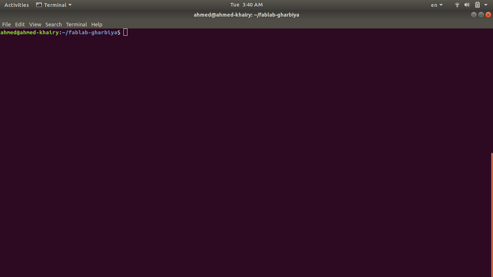
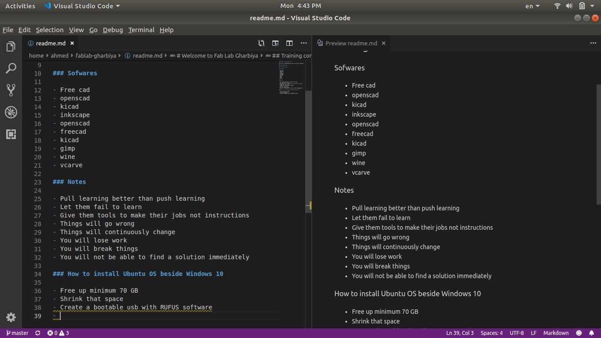

# Welcome to Fab Lab Gharbiya  

Hello this is STEM Gharbiya school's Fab Lab :sunglasses:

## Training contents

### Sofwares

- Free cad
- openscad
- kicad
- inkscape
- openscad
- freecad
- kicad
- gimp
- wine
- vcarve

### Notes

- Pull learning better than push learning
- Let them fail to learn
- Give them tools to make their jobs not instructions
- Things will go wrong
- Things will continuously change
- You will lose work
- You will break things
- You will not be able to find a solution immediately
- image consists of small blocks called matrix
- if i resize the image to smaller then try to revert it back again, that will destroy the image, it's better to make a new file
- It's better to document the machine condition and projects the created on it

### Project management

- To manage students flow by good method the machines and tools should be organized to make the processes related to each other next to each other arranged one by one
- Another method helps to manage students flow by prepare the students so that they can work alone and help each other, this can be done earlier in time there is no stress or load
- There are some steps students should follow to finish their projects well
  1. Think about idea
  2. Knowing about the lab and what can it do for them
  3. How to use these tools
  4. prototype
  5. present

### How to install Ubuntu OS beside Windows 10

1. Free up minimum 70 GB
2. Shrink that space

3. Create a bootable usb with RUFUS software

4. Boot from usb drive
5. Continue until page that let you choose between automatic installation and custom installation

6. Select something else
7. New partition
8. Make root partition
9. /

### Terminal Commands

- ls : used to list all content of the current directory
- clear : used to clear the screen of it's contents
- pwd : used to show the current directory
- cd .. : used to go back one directory
- cd : used to go to the home directory
- cd - : used to go to the last directory
- cd Arduino : used to change current directory to Arduino
- mkdir : used to make directory
- touch : used to make new file
- cat : used to show what is inside the file
- echo : used to show a message on the screen
- echo hello > readme.md : used to send hello to readme.md file
- man : used to show manual
- nano : used to edit text file
- git status : used to know the status of the md file i want to push
- convert : used to manipulate images, resize and rotate and etc.
- rm : used to delete files and folders

#### Notes about termianl

- Commands are sensitve case
- To add option to the command line we add - symbol, like >ls -l
  - if I use this the directory begin with d and file begin with - then permission then size in byte
  - ls -lh >> h : means human readable
- Using arrow keys : used to show old commands
- Using tab key to complete the commands

### github

1. First sign up for github and register your information and confirm your email ...

[sign up video]()

2. Naming the file readme.md ease showing it as a default document when open the respotory
3. My respotory can be public or private
4. First we create readme.md file, then push it to github, later we can edit it and write a commit of the editing
5. Text, images, emoji, tables, etc.... can be added to the file
- To delete your repository from setting, from bottom, danger zone, delete this repository
- To recover your repostory
  1. get the link of the reposotory
  2. download the folder by git clone link-of-the-folder
- if i want to push pdf file i have to convert it to jpg : convert farmer.pdf farmer.jpg
- then if i have to show the file i have to convert it again
- if any error happend copy the errror and search for it

### Steps of dealing with github

1. Sign up github
2. Confirm email
3. login with the registered email
4. Create new respotory (prefet names fabzero for now)
5. There are steps are shown on the new respotory page you should follow as you inside your local folder that contains your readme.md file like
    - git init
      - If the first command faced a problem caused by absent of git, you should follow the instructions appear to fix it
   - git add readme.md
   - git commit -m "first commit"
     - The message between the two symbols "" should be related to the editing
   - git remote add origin https://github.com/fablabgharbiya/fab.git
     - fablabgharbiya: depending on your user name and respotory name
   - git push -u origin master
     - used to push the file to the respotory
6. If you want to edit the readme.md
   - Edit your file
   - Open your terminal
   - Change your directory to the readme.md file
   - Write the following commands
     - git add .
        - used to add all modified files only
    - git commit -m "modified i have made"
    - git push 
7. If you want to delete files and recover it again, in case some thing happend and you want to back to earlier point
8. Deleting data is useful to recover when it lose

### Visual studio code

- I can use it to edit files
- It uses markdown language, it is like html but easier and easy to understand and read
- emoji can be used but after installing it's feature from the square on the lower left
- It is better to leave one line between each line, there is another feature used to help in this method named markdownlint

### Machines

#### vinyl cutter

Notes

- Don't use roll from the center
- If any one made mistage i take a photo of the mistake with paper write on it the mistake to make sure no one do that again
- When put the blade in it's holder it should be hidden for eye but can feel it by hand only
- The holder of the blade shouldn't be very tighten, just closed well
- There is optical sensor in the moving head
- It's better to create an outside rectangle when creating any design to be easy to stick
- Fabmodulas is better than cut studio because it's faster
- The prober way to store the roll is by using solotip or mask tap or something like that to keep the roll closed and keep it horizental
- There is a small space in the bottom back of the vinyl to attack the holder of the roll

Maintainence

- Clean the machine periodically from the dust
- The rubber stripe where the blade goes down should not be in good condition, and if it is not in good condition it should be replaced
- Use iso probeller to clean the sensors or any other alcohol but without water

Testing the blade

1. Check the blade using eye loop or digital microscope and check if the blade not broken
    - Cheese software can be used after connecting the digital microscope and select it as the active camera then check the blade condition
2. Put the roll in the machine
3. Insert the roll in the space specified for the roll
4. Put the two wheels under the white spots, and on the roll
5. Power on the machine and select roll
6. Long press on test
7. If the blade is good, the circle should be removed easily and the square stayes as it is

### Schedule

journal
  16/2/2019
  2/3/2019
  16/3/2019
  30/3/2019
  13/4/2019
  20/4/2019
  6 days journals

mid term
  25/3/2019 : 29/3/2019 : 5 days mid term

practical
  8/4/2019 : 12/4/2019 : 5 days pratical

poster
  13/4/2019 : 1 day poster

holidays
  11/2/2019 : 10/5/2019 : 18 days friday and saturday
  20/4/2019 : sinai : 1 day

exams
  13/5/2019 : 24/5/2019

total days : 105
wasted days : 46
60 days to work

EDP
  define the problem
  Research
  Other Solutions Already Tried

  Selection of Solution
  Selection of Prototype

  Test Plan
  Data Collection

  Analysis and Discussion
  Recommendations
  
  Learning Outcomes

### Useful websites

[emoji](https://www.webfx.com/tools/emoji-cheat-sheet/)

[github](https://github.com/)

[markdown](https://github.com/adam-p/markdown-here/wiki/Markdown-Cheatsheet)
